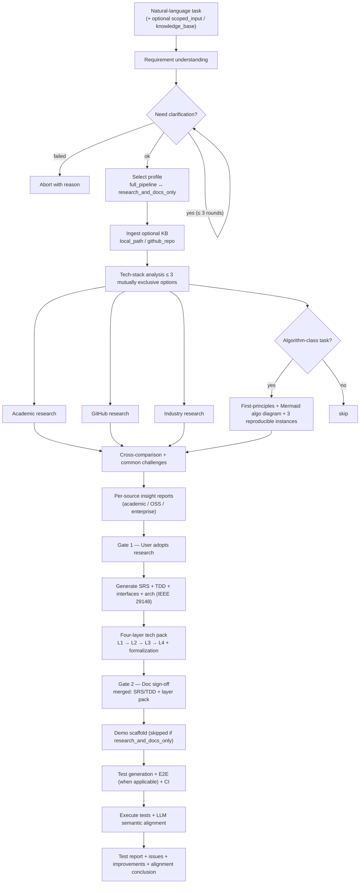

# ProtoGenius

> **Task In, Researched Prototype Out** — Autonomous Research-to-Prototype Agent for Task Validation.

ProtoGenius is an end-to-end task validation agent. The user supplies a single
natural-language task description (or a scoped input — see §2.7 below); the
system autonomously performs **analysis → clarification → research → design →
development → verification**, producing a runnable prototype together with
IEEE 29148-aligned engineering documentation, a four-layer technical-asset
pack, structured insight reports for every adopted research source, a test
suite, CI configuration and an LLM-based semantic alignment report against
the frozen SRS / TDD.

ProtoGenius ships as a **Cursor Cloud Agent** with first-class **subagent /
skill / hook** composition, plus a Python package (`protogenius`) that hosts the
state machine, research adapters, document generators and CI scaffolds.

> **Spec version**: this repo implements **v2** of the requirements
> document. Key v2 additions vs. v1: structured-requirements fields
> (`core_objectives` / `challenges` / `constraints`), per-source insight
> reports (academic / OSS / enterprise), four-layer tech doc pack with a
> mandatory formalization block, run profiles
> (`full_pipeline` ↔ `research_and_docs_only`), scoped research, optional
> knowledge-base connector, and a merged TDD + layer-pack sign-off gate.

---

## At a glance

| Aspect                | Default                                                                 |
| --------------------- | ----------------------------------------------------------------------- |
| Delivery form         | Cursor Cloud Agent + Python CLI (`protogenius`)                         |
| Dependency install    | `pip install`, `npm install`, `docker pull` allowed                     |
| Networking            | Open by default (no allow-list)                                         |
| Credentials           | Injected via user-supplied config (`config/*.yaml` + env)               |
| Acceptance platforms  | Windows + Linux (macOS is **not** a v1 acceptance target)               |
| Per-run hard caps     | 50 turns, 100 search hits, 1M tokens, < 6h wall time                    |
| Human-in-the-loop     | Two **blocking gates** (research adoption, doc sign-off) + clarification|

---

## Pipeline (v2)



A textual mirror of the state machine lives in [`docs/state-machine.md`](docs/state-machine.md).

---

## Repository layout

```
.
├── .cursor/             # Cursor agent surface: rules, commands, subagents, skills, hooks, mcp.json
├── config/              # Default YAML config (quotas, models, search policy)
├── protogenius/         # Python package implementing the orchestration runtime
│   ├── orchestrator.py  # main driver
│   ├── state_machine.py # finite-state machine with blocking gates
│   ├── research/        # arXiv / SemanticScholar / OpenAlex / GitHub / Industry adapters
│   ├── docs/            # IEEE 29148 SRS / TDD / interfaces / architecture generators
│   ├── demo/            # demo scaffolds (fullstack / script / algo) + selection logic
│   ├── testing/         # test spec layer, generator, E2E, CI generator, LLM alignment
│   ├── hooks/           # quota guard, citation audit, gate-check
│   └── prompts/         # reusable prompt templates
├── templates/           # IEEE 29148-aligned SRS / TDD / Test Plan / Test Report templates
├── docs/                # human-facing documentation
├── tests/               # pytest unit tests
├── examples/            # example task inputs
└── .github/workflows/   # CI on Ubuntu + Windows; optional E2E job
```

---

## Quick start

```bash
# 1. Install
python -m venv .venv && source .venv/bin/activate
pip install -e ".[dev]"

# 2. Configure (edit a copy of the defaults to set API keys, MCP URLs, ...)
cp .env.example .env
$EDITOR .env config/default.yaml

# 3. Run a task
protogenius run "Build a Slack-style chat with end-to-end search over message history"

# 4. Inspect artifacts
ls runs/<run-id>/
#   ├── srs.md             (IEEE 29148)
#   ├── tdd.md             (IEEE 29148)
#   ├── research/*.md
#   ├── prototype/         (generated demo source)
#   ├── tests/             (executable spec)
#   ├── reports/           (test + alignment)
#   └── audit.jsonl        (every citation, decision, quota event)
```

`protogenius` is also designed to be **driven directly by Cursor** — open the
repository in Cursor Cloud, configure secrets, and use the slash commands in
`.cursor/commands/` (`/start-task`, `/confirm-research`, `/confirm-docs`, etc.).
The orchestrator state machine is shared between the two entry points.

---

## Human-in-the-loop gates (v2)

| Gate                  | Trigger                                                   | Behavior on missing confirmation |
| --------------------- | --------------------------------------------------------- | -------------------------------- |
| Clarification         | Ambiguity / missing constraints                           | Up to **3 rounds**; abort on failure |
| Research adoption     | After insight reports for every accepted source produced  | **Block** SRS/TDD draft & coding |
| Document sign-off     | After SRS / TDD / interfaces / arch + **four-layer pack** | **Block** demo build & CI       |

By default the second gate covers **both** the SRS/TDD bundle and the
four-layer pack in a single confirmation (v2 §3 — *merged sign-off*).
Set `documents.merge_tdd_and_layer_signoff: false` to split into two
consecutive rounds.

"Fully automatic" applies **between** confirmed gates only — the gates
themselves always require human input.

---

## Quotas & audit (defaults, see `config/quotas.yaml`)

| Resource         | Hard cap |
| ---------------- | -------- |
| Agent turns      | 50       |
| Search results   | 100      |
| Tokens           | 1 000 000|
| Wall time        | 6 hours  |

Every research artifact carries `url / doi / version` as appropriate (recorded
in `audit.jsonl`).

---

## Compliance notes

- Third-party code licenses are recorded; copied snippets pin the SPDX
  identifier in the artifact's frontmatter (see [`docs/compliance.md`](docs/compliance.md)).
- No PII is collected by default; tasks that touch personal data must enable
  the relevant config switches.
- Internal company codebases are an **opt-in** research target — configure
  scope, repositories and credentials explicitly in `config/default.yaml`.

---

## Roadmap (non-normative)

1. Cloud-agent orchestration with subagent / skill / hook split — **v1**
2. MCP integration (arXiv, GitHub Copilot) + search pipeline — **v1**
3. Human gate state machine (incl. v2 merged sign-off) — **v1 / v2**
4. IEEE 29148 SRS / TDD generators — **v1**
5. **Insight report skills (academic / OSS / enterprise)** — **v2**
6. **Four-layer technical doc generator with formalization block** — **v2**
7. **Domain knowledge-base connector (`local` / `github`)** — **v2**
8. **Scoped-research router (`full_pipeline` ↔ `research_and_docs_only`)** — **v2**
9. Code generation, build scripts, demo scaffolds — **v1**
10. Test gen, E2E, CI, LLM-alignment reporting — **v1**

See the requirements document (frozen at v2) for full normative content.
A read-only copy of v1 lives next to v2 for traceability.

## License

MIT — see [LICENSE](LICENSE).
