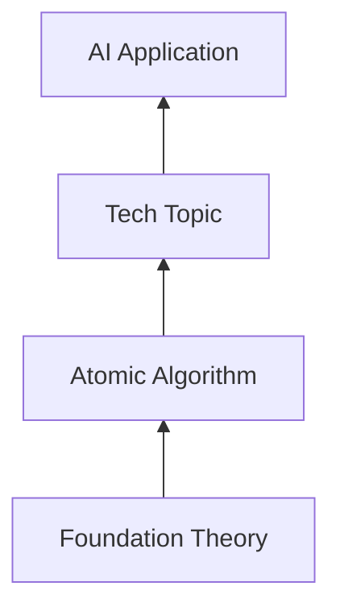

# Four-layer technical documentation (v2 §4.4)

ProtoGenius v2 generates a **four-layer technical-asset pack** alongside
the IEEE 29148 SRS/TDD. Bottom-up dependency:



| Layer id            | Purpose                                                        |
|---------------------|----------------------------------------------------------------|
| `foundation_theory` | Symbols, axioms, theorems, applicability domain.               |
| `atomic_algorithm`  | Single-purpose algorithms / models with complexity bounds.     |
| `tech_topic`        | Full-spectrum solution families for a specific business domain.|
| `ai_application`    | End-user product or agent (architecture + data + UX).          |

## Templates and generators

| Layer               | Template                                          | Generator                |
|---------------------|---------------------------------------------------|--------------------------|
| `foundation_theory` | `templates/layer_l1_foundation_theory.md`         | `LayerDocsGenerator`     |
| `atomic_algorithm`  | `templates/layer_l2_atomic_algorithm.md`          | `LayerDocsGenerator`     |
| `tech_topic`        | `templates/layer_l3_tech_topic.md`                | `LayerDocsGenerator`     |
| `ai_application`    | `templates/layer_l4_ai_application.md`            | `LayerDocsGenerator`     |

Each layer has a recommended body-field set in
`protogenius.docs.layer_docs.LAYER_SPECS`. A sub-agent fills `body` and
hands it to `LayerDocsGenerator.render_layer`.

## YAML frontmatter (mandatory)

```yaml
---
name: <doc name>
description: <one-line description>
layer: <one of the four layer ids>
version: v1.0.0
version_type: create
related_versions: ""
template_version: v2-§4.4.X
run_id: <orchestrator run id>
generated_by: ProtoGenius
---
```

## Formalization block (v2 §4.4.5 — hard requirement)

Every layer doc MUST include a `## 形式化定义` block. The mandatory
elements per layer are:

| Layer               | Required formalization elements                                                            |
|---------------------|--------------------------------------------------------------------------------------------|
| `foundation_theory` | Symbol table; axioms / theorems; core derivation; applicability domain \( \mathcal{D} \).  |
| `atomic_algorithm`  | I/O space; objective function or decision rule; time & space complexity; correctness.      |
| `tech_topic`        | Problem formalization; solution family \( \mathcal{F} \); selection conditions; metrics.   |
| `ai_application`    | User objective function; system state machine; SLA / security / compliance constraints.   |

`LayerDocsGenerator` runs a regex check after rendering and raises
`FormalizationBlockMissingError` if the heading is missing, unless
`layer_docs.require_formalization_block: false` is set.

## Minimum-content baseline (v2 §2.5)

Every layer doc must contain:

1. YAML frontmatter.
2. A basic / core info section (rendered as `## 1. ...`).
3. The formalization block above.
4. A references list.

Violations raise `LayerDocMinimumContentError` unless
`layer_docs.enforce_minimum_content: false`.

## Versioning fields

| Field              | Purpose                                                            |
|--------------------|--------------------------------------------------------------------|
| `version`          | Logical version (default `v1.0.0`).                                |
| `version_type`     | `create` / `feature` / `fix` / `optimize` / `deprecate`.           |
| `related_versions` | Comma-separated list of prior versions this doc supersedes.        |
| `change_summary`   | One-line description of what changed.                              |

## Coverage note (v2 §2.5)

The renderer inserts a `## coverage_note` block at the top listing which
fields were filled vs. dropped, with a one-line reason per omission.
See `protogenius.coverage` for the available reason constants.

## `kb_ref` and conflicts

When a layer doc reuses a KB entry, the generator renders a dedicated
section:

```
## 知识库引用 (`kb_ref`)

- `kb://atomic_algorithm/beam_search.md@abc1234`
```

If a conflict is detected with the KB, the generator renders:

```
## ⚠ 与知识库冲突

- KB doc 'Vintage Beam Search' appears related but differs from generated 'Beam Search'
```

The audit log records each conflict as a `decision: kb_conflict` event;
the doc-signoff gate surfaces them to the user.

## Scoped runs

Scoped tasks generate only a subset of the four layers — see
[`docs/profiles.md`](profiles.md). The scope-router decides via
`protogenius.research.scope.select_layers`.
