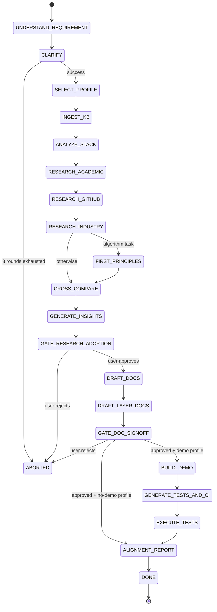

# State machine (v2)

This document mirrors the machine declared in
`protogenius/state_machine.py` so reviewers do not need to read code to
understand the pipeline.

## Stages

| # | Stage                       | Description                                                  | Blocking gate |
|---|-----------------------------|--------------------------------------------------------------|---------------|
| 0 | `INIT`                      | Entry sentinel.                                              |               |
| 1 | `UNDERSTAND_REQUIREMENT`    | Parse and structure the user's task.                         |               |
| 2 | `CLARIFY`                   | Up to 3 rounds; fill `core_objectives`/`challenges`/`constraints`. |       |
| 3 | `SELECT_PROFILE`            | v2 §2.6/§2.7 — pick `full_pipeline` vs `research_and_docs_only`. |        |
| 4 | `INGEST_KB`                 | v2 §2.8 — materialize local or GitHub KB (no-op when absent).|               |
| 5 | `ANALYZE_STACK`             | Up to 3 mutually-exclusive tech-stack options.               |               |
| 6 | `RESEARCH_ACADEMIC`         | arXiv (MCP) + Semantic Scholar + OpenAlex + venue scrapers.  |               |
| 7 | `RESEARCH_GITHUB`           | GitHub via the Copilot-hosted MCP; rank + cutoff-include-all.|               |
| 8 | `RESEARCH_INDUSTRY`         | Vendor-blog survey (seven targets, frozen).                  |               |
| 9 | `FIRST_PRINCIPLES`          | Conditional — only for algorithm / model / optimization tasks. |             |
| 10| `CROSS_COMPARE`             | Comparison table + common challenges.                        |               |
| 11| `GENERATE_INSIGHTS`         | v2 §2.4.A/B/C — one report per accepted source.              |               |
| 12| `GATE_RESEARCH_ADOPTION`    | Await user confirmation before drafting.                     | **yes**       |
| 13| `DRAFT_DOCS`                | SRS + TDD + interfaces + arch diagram (IEEE 29148).          |               |
| 14| `DRAFT_LAYER_DOCS`          | v2 §4.4 — four-layer pack with `## 形式化定义` blocks.       |               |
| 15| `GATE_DOC_SIGNOFF`          | v2 §3 — by default covers BOTH SRS/TDD and the four-layer pack. | **yes**    |
| 16| `BUILD_DEMO`                | Scaffold + LLM-refine the prototype. **Skipped** under `research_and_docs_only`. | |
| 17| `GENERATE_TESTS_AND_CI`     | Test spec, materialization, E2E + CI workflow. Skipped under no-demo. |   |
| 18| `EXECUTE_TESTS`             | Run the materialized suite. Skipped under no-demo.           |               |
| 19| `ALIGNMENT_REPORT`          | LLM semantic alignment vs SRS/TDD.                           |               |
| 20| `DONE`                      | Run complete.                                                |               |
| —  | `ABORTED`                  | Set when quota, clarification or gate refusal forces abort.  |               |

## Mermaid view

## Quota interaction

- Every stage entry consumes **one turn** from `QuotaLedger.turns`.
- Every search query consumes `query.max_results` from
  `QuotaLedger.search_results` (pre-charged by the `pre_search` hook).
- Every LLM response charges `prompt_tokens + completion_tokens` against
  `QuotaLedger.tokens`.
- `walltime_seconds` is checked at every stage entry and before every search.
- Scoped runs (v2 §2.7) multiply each query's `max_results` by
  `scoped_input.quota_scale_factor` (default 0.5). Caps from §7.1 are
  never raised — only tightened.

## Profile-aware skip (v2 §2.6 / §2.7 / §5)

When the effective profile is `research_and_docs_only`, the orchestrator
short-circuits the three demo-only stages
(`BUILD_DEMO` / `GENERATE_TESTS_AND_CI` / `EXECUTE_TESTS`). Each skip is
recorded in `audit.jsonl` as `info: stage skipped — research_and_docs_only profile`.
`ALIGNMENT_REPORT` still runs against the SRS/TDD bundle so the audit
trail carries a coverage verdict regardless of profile.
