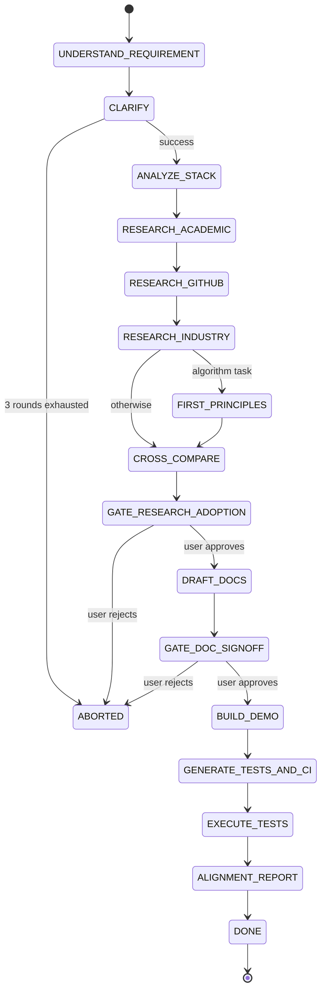

# State machine

This document mirrors the machine declared in
`protogenius/state_machine.py` so reviewers do not need to read code to
understand the pipeline.

## Stages

| # | Stage                       | Description                                                  | Blocking gate |
|---|-----------------------------|--------------------------------------------------------------|---------------|
| 0 | `INIT`                      | Entry sentinel.                                              |               |
| 1 | `UNDERSTAND_REQUIREMENT`    | Parse and structure the user's task.                         |               |
| 2 | `CLARIFY`                   | Up to 3 rounds of clarifying questions; abort on failure.    |               |
| 3 | `ANALYZE_STACK`             | Up to 3 mutually-exclusive tech-stack options.               |               |
| 4 | `RESEARCH_ACADEMIC`         | arXiv (MCP) + Semantic Scholar + OpenAlex + venue scrapers.  |               |
| 5 | `RESEARCH_GITHUB`           | GitHub via the Copilot-hosted MCP; rank + cutoff-include-all.|               |
| 6 | `RESEARCH_INDUSTRY`         | Vendor-blog survey (seven targets, frozen).                  |               |
| 7 | `FIRST_PRINCIPLES`          | Conditional — only for algorithm / model / optimization tasks. |             |
| 8 | `CROSS_COMPARE`             | Comparison table + common challenges.                        |               |
| 9 | `GATE_RESEARCH_ADOPTION`    | Await user confirmation before drafting.                     | **yes**       |
| 10| `DRAFT_DOCS`                | SRS + TDD + interfaces + arch diagram (IEEE 29148).          |               |
| 11| `GATE_DOC_SIGNOFF`          | Await user confirmation before building.                     | **yes**       |
| 12| `BUILD_DEMO`                | Scaffold + LLM-refine the prototype.                         |               |
| 13| `GENERATE_TESTS_AND_CI`     | Test spec, materialization, E2E + CI workflow.               |               |
| 14| `EXECUTE_TESTS`             | Run the materialized suite; capture JUnit XML.               |               |
| 15| `ALIGNMENT_REPORT`          | LLM semantic alignment vs SRS/TDD.                           |               |
| 16| `DONE`                      | Run complete.                                                |               |
| —  | `ABORTED`                  | Set when quota, clarification or gate refusal forces abort.  |               |

## Mermaid view

## Quota interaction

- Every stage entry consumes **one turn** from `QuotaLedger.turns`.
- Every search query consumes `query.max_results` from
  `QuotaLedger.search_results` (pre-charged by the `pre_search` hook).
- Every LLM response charges `prompt_tokens + completion_tokens` against
  `QuotaLedger.tokens`.
- `walltime_seconds` is checked at every stage entry and before every search.
