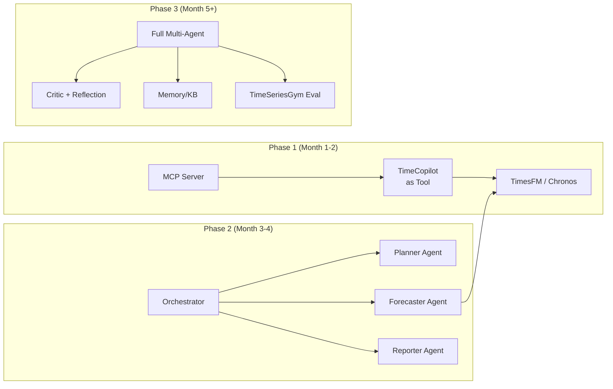

# L3 技术专题层 — Tech Topic
## Agentic AI 时代下的时间序列分析与预测

> **coverage_note**: 本文档为任务的主文档（scoped_input.type = topic）。覆盖全部四大范式、代表性系统、评测范式、与传统方法的对比、以及平台采纳路径。省略了单一算法的实现细节（见 L2）和纯数学推导（见 L1）。

---

## 1. 引言

### 1.1 背景

2025-2026 年，时间序列分析领域经历了从 **模型中心（Model-Centric）** 到 **Agent 中心（Agent-Centric）** 的范式转变。传统方法将预测视为单次模型推理；新范式将预测视为一个迭代过程——Agent 感知数据、选择工具、执行分析、反思结果、积累经验。

这一转变由三个趋势推动：
1. **时间序列基础模型 (TSFM)** 的成熟：TimesFM、Chronos、Timer-S1 实现零样本泛化
2. **LLM 工具使用能力** 的提升：GPT-5、Claude 4、Qwen3 可稳定调用外部工具
3. **Agent 协议标准化**：MCP (Model Context Protocol) 提供了 Agent-to-Data 的统一接口

### 1.2 术语定义

| 术语 | 定义 |
|------|------|
| ATSF | Agentic Time Series Forecasting — 将预测视为 Agent 过程的范式 |
| TSFM | Time-Series Foundation Model — 大规模预训练的时序模型 |
| TS-MLLM | Time-Series Multimodal LLM — 将时序作为原生模态的多模态大模型 |
| MCP | Model Context Protocol — Agent 连接外部数据源的标准协议 |
| ADK | Agent Development Kit — Google 的 Agent 开发框架 |

---

## 2. 四大范式

### 2.1 P1: 多智能体分解 (Multi-Agent Decomposition)

**核心思想**: 将复杂 TS 任务分解为多个子任务，每个子任务由专业化 Agent 负责。

**代表系统**:

| 系统 | Agent 结构 | 任务类型 | 来源 |
|------|-----------|----------|------|
| Nexus | Macro + Micro + Context + Integration | 预测 | Google, May 2026 |
| TimeSeriesScientist | Curator + Planner + Forecaster + Reporter | 通用分析 | Yale et al., Oct 2025 |
| CastClaw | Planner + Forecaster + Critic (+ Human) | 预测 | USTC, Mar 2026 |
| SAGE | 4 Analyzers + Detector + Supervisor | 异常检测 | May 2026 |
| TSAD-Agents | Scanning + Planning + Detection + Checking | 异常检测 | WWW 2026 |
| MAS4TS | Analyzer + Reasoner + Executor | 通用（含 VLM） | HKUST-GZ, Feb 2026 |

**设计模式**:
```
Task → Orchestrator → [Agent₁ ∥ Agent₂ ∥ ...] → Critic → Output
                          ↑                          │
                          └──── Feedback Loop ───────┘
```

**优势**: 可解释性（每个 Agent 的中间输出可审计）、可扩展性（新增能力 = 新增 Agent）、容错性（单 Agent 失败不影响整体）

**挑战**: Agent 间通信开销、协调一致性、总 token 消耗高

### 2.2 P2: 工具增强 LLM 推理 (Tool-Augmented LLM Reasoning)

**核心思想**: 单一 LLM Agent 通过调用外部统计/ML 工具完成 TS 任务。LLM 负责推理和决策，工具负责计算。

**代表系统**:

| 系统 | 工具数量 | 训练方法 | 来源 |
|------|---------|---------|------|
| TimeART | 21 工具 | TimeToolBench (100K轨迹) 微调 8B | Jan 2026 |
| TS-Agent | ~10 工具 | ReAct + self-refinement | Oct 2025 |
| TimeCopilot | 30+ TSFMs 作为工具 | LLM orchestration (无微调) | NeurIPS 2025 |
| ChatAD | TSAD 工具集 | TSEvol + TKTO 优化 | Jan 2026 |

**关键发现** (TimeART):
> "工具选择比模型大小更重要——8B 模型 + 正确工具 > 70B 模型无工具"

**设计模式**:
```
Query → LLM(Reason) → Select Tool → Execute → Observe → Reason → ... → Output
        ↑                                               │
        └───────────── ReAct Loop ─────────────────────┘
```

**优势**: 实现简单、单 Agent 即可工作、延迟较低（无 Agent 通信）

**挑战**: 工具选择错误时无法自我纠正（除非加 Critic）、受限于工具能力上限

### 2.3 P3: 基础模型 + Agent 接口 (Foundation Model + Agent Interface)

**核心思想**: 将强大的 TSFM 暴露为 Agent 可调用的工具/技能，通过 MCP/ADK 等协议标准化接口。

**代表系统**:

| 系统 | 模型 | 接口 | 来源 |
|------|------|------|------|
| TimesFM Agent Skill | TimesFM 2.5 (200M) | ADK + MCP | Google, 2026 |
| BigQuery AI.FORECAST | TimesFM in BQ | SQL | Google, Mar 2026 GA |
| LangTime | Custom (PPO-tuned) | API | ICML 2025 |
| Chronos-2 + TimeCopilot | Chronos-2 (710M) | Python SDK | Amazon + Nixtla |

**MCP 工具定义示例** (TimesFM Agent Skill):
```json
{
  "name": "timesfm_forecast",
  "description": "Zero-shot forecasting using TimesFM 2.5",
  "inputSchema": {
    "series": "array<number>",
    "horizon": "integer",
    "frequency": "string"
  }
}
```

**设计模式**:
```
External Agent → MCP Client → MCP Server → TSFM Inference → Response
```

**优势**: 最低集成门槛、生产就绪（Google BigQuery 已 GA）、模型可替换

**挑战**: 黑盒预测（无推理过程）、无自适应（不会因结果差而换模型）

### 2.4 P4: MLLM 原生时序推理 (Multimodal LLM Native TS Reasoning)

**核心思想**: 将时间序列作为多模态 LLM 的原生输入模态（类似图像），LLM 直接"看到"和"理解"时间序列。

**代表系统**:

| 系统 | 模型规模 | 模态处理方式 | 来源 |
|------|---------|------------|------|
| ChatTS | 8B / 14B | TS 编码为 embedding | ByteDance, VLDB 2025 |
| ANOMSEER | MLLM + TimerPO | TS 渲染为图 + RL 对齐 | Feb 2026 |
| MAS4TS (VLM branch) | VLM | TS 渲染为可视化 | HKUST-GZ, Feb 2026 |

**ChatTS vs GPT-4o** (在 TS 任务上):
- 分类任务: ChatTS +46-76%
- 数值对齐: ChatTS +80-113%

**设计模式**:
```
Time Series → TS Encoder / Visual Renderer → MLLM → Reasoning + Answer
```

**优势**: 无需显式工具调用、深度理解时序模式、可直接回答自然语言问题

**挑战**: 需要大量 TS 训练数据、推理代价高（8B+ 模型）、预测精度不如专用 TSFM

---

## 3. 与传统方法的对比

### 3.1 预测精度对比

| 方法类别 | GIFT-Eval MASE | 代表 | 备注 |
|----------|---------------|------|------|
| 传统统计 (ARIMA/ETS) | ~1.0 (baseline) | statsmodels | 无需训练 |
| 深度学习 (Transformer) | 0.85-0.95 | PatchTST, iTransformer | 需要领域数据 |
| TSFM (零样本) | 0.69-0.80 | TimesFM, Timer-S1 | 无需训练 |
| Agentic (P2: 工具增强) | 0.65-0.75 | TimeCopilot | LLM 选择最优工具 |
| Agentic (P1: 多 Agent) | 未标准化 | Nexus, TSci | 指标不可直接比较 |

### 3.2 适用场景对比

| 场景 | 传统方法 | TSFM 直接推理 | Agentic 方法 | 推荐 |
|------|---------|--------------|-------------|------|
| 单一领域、大量历史 | ✅ 最优 | ✅ 可用 | ❌ 过度 | 传统 |
| 跨领域、零样本 | ❌ 不适用 | ✅ 最优 | ✅ 可用 | TSFM |
| 复杂分析 + 解释 | ❌ 不适用 | ❌ 无解释 | ✅ 最优 | Agentic |
| 异常检测 + 诊断 | ⚠️ 规则 | ⚠️ 有限 | ✅ 最优 | Agentic |
| 实时、低延迟 | ✅ 最优 | ✅ 可用 | ❌ 延迟高 | 传统/TSFM |

### 3.3 计算成本对比

| 方法 | 单次预测成本 | 是否需要 GPU | Token 消耗 |
|------|------------|-------------|-----------|
| ARIMA | ~1ms (CPU) | 否 | 0 |
| TimesFM 推理 | ~100ms (GPU) | 是 (推荐) | 0 |
| Agentic P2 (单 Agent) | ~5-30s | 是 (LLM + TSFM) | ~1K-10K |
| Agentic P1 (多 Agent) | ~30-120s | 是 (多次 LLM) | ~10K-100K |

---

## 4. 评测范式

### 4.1 现有基准

| 基准 | 评测维度 | 覆盖范式 | 来源 |
|------|---------|---------|------|
| GIFT-Eval | 零样本预测精度 (MASE, CRPS) | P3 | Nixtla |
| TimeSeriesGym | Agent ML 工程能力 (34 tasks) | P1, P2 | CMU, NeurIPS 2025 |
| VisualTimeAnomaly | MLLM 异常检测 | P4 | WWW 2026 |
| TimeToolBench | 工具选择正确率 (100K 轨迹) | P2 | TimeART, 2026 |

### 4.2 评测差距

**缺失的统一基准**:
- 无基准同时评测 **预测精度** + **Agent 任务成功率** + **成本效率**
- 无跨范式公平比较（P1 vs P2 vs P3 vs P4）
- 无长期运行稳定性评测（Agent 在 100+ 连续预测中的退化）

**建议的评测维度**:

| 维度 | 指标 | 说明 |
|------|------|------|
| 精度 | MASE, CRPS, F1 (异常) | 核心预测/检测质量 |
| 效率 | Latency (p50/p95), Token/预测 | 生产成本 |
| 鲁棒性 | 分布漂移后精度保持率 | 长期可靠性 |
| 可解释性 | 解释正确率 (人类评估) | 信任度 |
| 自主性 | 人工干预频率 | 自动化程度 |

---

## 5. 平台采纳路径

### 5.1 推荐架构



### 5.2 关键决策点

| 决策 | 选项 A | 选项 B | 推荐 |
|------|--------|--------|------|
| TSFM 选择 | TimesFM (JAX, 200M) | Time-MoE (PyTorch, 2.4B) | A（生态更好）; B（成本敏感） |
| Agent 框架 | OpenAI Agents SDK | Qwen-Agent | A（社区大）; B（MCP 原生） |
| 部署方式 | Cloud API (BigQuery) | 自托管 GPU | 视数据敏感性决定 |
| 评测基准 | GIFT-Eval | TimeSeriesGym | 两者都用（互补） |

### 5.3 风险与缓解

| 风险 | 影响 | 缓解策略 |
|------|------|----------|
| Agent 幻觉（虚假预测结论） | 高 | Critic Agent + 置信度阈值 + 人工审核门 |
| Token 成本失控 | 中 | 硬性 token 预算（v2 §7.1 模式）+ 成本监控 |
| TSFM 版本漂移 | 中 | 模型版本锁定 + A/B 测试 |
| MCP 协议变更 | 低 | 抽象层隔离 + 版本兼容测试 |

---

## 6. 形式化定义

### 6.1 Agentic Time-Series Analytics System

$$\mathcal{ATAS} = (\mathcal{E}, \mathcal{A}, \mathcal{T}, \mathcal{D}, \mathcal{I}, \mathcal{M}, \Phi)$$

其中：
- $\mathcal{E}$: 环境 — 时间序列数据源集合
  - $\mathcal{E} = \{(X^{(i)}, \text{meta}^{(i)})\}_{i=1}^{N_{src}}$
  - $X^{(i)} \in \mathbb{R}^{T_i \times d_i}$: 第 $i$ 个数据源的时间序列
  - $\text{meta}^{(i)}$: 频率、领域标签、质量指标
- $\mathcal{A} = \{A_1, ..., A_n\}$: Agent 池
  - 每个 $A_j = (\text{role}_j, \text{tools}_j, \text{memory}_j, \pi_j)$
  - $\pi_j$: Agent $j$ 的策略函数（LLM 驱动）
- $\mathcal{T} = \{t_1, ..., t_K\}$: 工具注册表 ($K \geq 15$)
  - 每个 $t_k = (\text{name}, \text{schema}_{in}, \text{schema}_{out}, \text{cost}, \text{latency})$
- $\mathcal{D}$: 数据连接层
  - $\mathcal{D}: \text{Query} \to \mathcal{E}$ 通过 MCP 协议
- $\mathcal{I}$: 交互接口
  - $\mathcal{I}_{MCP}$: MCP Server (Agent-to-Agent)
  - $\mathcal{I}_{NL}$: 自然语言接口 (Human-to-Agent)
  - $\mathcal{I}_{API}$: REST API (System-to-Agent)
- $\mathcal{M}$: 记忆与上下文管理
  - $\mathcal{M}_{short}$: 会话内上下文（token window）
  - $\mathcal{M}_{long}$: 跨会话经验（向量存储）
- $\Phi$: 评测与观测框架
  - $\Phi_{accuracy}$: MASE, CRPS, F1 (异常检测)
  - $\Phi_{efficiency}$: latency, token_usage, cost
  - $\Phi_{robustness}$: drift_resilience, error_rate_over_time

### 6.2 范式选择函数

$$\text{ParadigmSelect}(\text{task}, \text{constraints}) \to P_i \in \{P1, P2, P3, P4\}$$

决策规则:
$$P_i = \begin{cases}
P3 & \text{if task is simple forecast AND latency < 30s} \\
P2 & \text{if task requires tool selection AND single-agent sufficient} \\
P1 & \text{if task is complex AND requires multiple specializations} \\
P4 & \text{if task requires deep TS understanding AND explanation}
\end{cases}$$

### 6.3 MCP 工具调用形式化

$$\text{MCP}_{call}(t_k, \text{params}) = \begin{cases}
(\text{result}, \text{meta}) & \text{if } \text{validate}(\text{params}, t_k.\text{schema}_{in}) \\
\text{Error}(\text{reason}) & \text{otherwise}
\end{cases}$$

约束:
- $\sum_{k} \text{cost}(t_k) \leq \text{Budget}_{token}$ (v2 §7.1: 1M tokens)
- $\text{latency}(t_k) \leq \text{SLA}_{latency}$ (NFR-01/02)
- $|\{t_k \text{ called}\}| \leq \text{Budget}_{search}$ (v2 §7.1: 100 results)

### 6.4 Agent 质量保证循环

$$\text{QA}_{loop}: \text{Output} \xrightarrow{\text{Critic}} \begin{cases}
\text{Accept} & \text{if confidence} \geq \tau \\
\text{Retry}(A_j, \text{feedback}) & \text{if confidence} < \tau \text{ AND turns} < \text{max}
\end{cases}$$

---

## 7. 开放问题与未来方向

1. **统一评测框架**: 需要同时衡量精度、成本、可解释性的综合基准
2. **Agent 记忆的时序特化**: 如何让 Agent "记住"周期性模式和历史决策
3. **实时 Agent**: 当前系统均为批处理；流式 Agent 是下一步
4. **安全部署**: 自主预测系统的失败模式和兜底机制
5. **多模态融合**: 文本 + 数值 + 视觉 的最优组合策略

---

## 8. 参考文献

| # | 引用 | 类型 |
|---|------|------|
| 1 | Nexus (Google, arXiv:2605.14389, May 2026) | Academic |
| 2 | ATSF Position Paper (USTC, arXiv:2602.01776, Feb 2026) | Academic |
| 3 | MAS4TS (HKUST-GZ, arXiv:2602.03026, Feb 2026) | Academic |
| 4 | TSAD-Agents (WWW 2026, doi:10.1145/3774904.3792376) | Academic |
| 5 | TimeART (arXiv:2601.13653, Jan 2026) | Academic |
| 6 | TimeSeriesScientist (arXiv:2510.01538, Oct 2025) | Academic |
| 7 | TimeCopilot (NeurIPS 2025, arXiv:2509.00616) | Academic+OSS |
| 8 | TimeSeriesGym (NeurIPS 2025, arXiv:2505.13291) | Academic |
| 9 | LangTime (ICML 2025) | Academic |
| 10 | TimesFM 2.5 (Google, github.com/google-research/timesfm) | OSS+Enterprise |
| 11 | ChatTS (ByteDance, VLDB 2025, github.com/NetManAIOps/ChatTS) | OSS+Enterprise |
| 12 | Timer-S1 (ByteDance, huggingface.co/bytedance-research/Timer-S1) | Enterprise |
| 13 | Time-MoE (Alibaba, ICLR 2025, github.com/Time-MoE/Time-MoE) | Enterprise |
| 14 | MCP (Anthropic, modelcontextprotocol.io) | Enterprise |
| 15 | BigQuery AI.FORECAST (Google Cloud, Mar 2026 GA) | Enterprise |
| 16 | Qwen-Agent (Alibaba, github.com/QwenLM/Qwen-Agent) | Enterprise |
