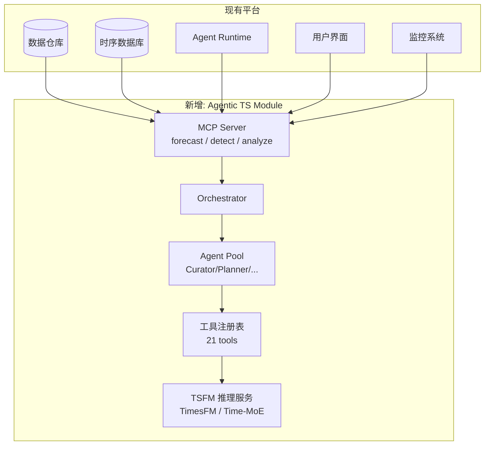

# L4 AI 应用层 — AI Application
## Agentic TS 系统在内部平台的落地方案

> **coverage_note**: 本文档为应用层，聚焦于将 L1-L3 的理论/算法/技术方案落地为可部署的平台功能。省略了底层数学推导（见 L1）、算法实现细节（见 L2）和范式对比分析（见 L3）。目标读者：平台架构师和工程团队。

---

## 1. 应用场景映射

### 1.1 平台需求 → Agentic TS 能力矩阵

| 业务场景 | 所需能力 | 推荐范式 | 参考实现 |
|----------|---------|---------|---------|
| 销量/需求预测 | 零样本多频率预测 + 不确定性量化 | P3 (TSFM + MCP) | TimesFM Agent Skill |
| 基础设施监控 | 实时异常检测 + 自动诊断 | P1 (多 Agent) | Argos / SAGE |
| 财务预测与规划 | 多场景模拟 + 自然语言报告 | P2 (工具增强) | Claude Financial Agents |
| 数据探索与分析 | 交互式 QA + 可视化 | P4 (MLLM 原生) | ChatTS |
| MLOps 自动化 | 模型选择 + 超参调优 + CI/CD | P2 + P1 | TimeCopilot + TimeSeriesGym |

### 1.2 优先级排序

基于 core_objectives 和 constraints，推荐实施顺序：

```
Phase 1: MCP Server + TSFM 推理服务 (P3)
    └─→ 最低风险，最快落地，Google BigQuery 已验证
    
Phase 2: 工具增强 Agent (P2)
    └─→ 在 P3 基础上增加 LLM 推理层，支持自然语言交互
    
Phase 3: 多 Agent 系统 (P1)
    └─→ 复杂场景（监控 + 诊断 + 报告的完整闭环）
    
Phase 4 (远期): MLLM 原生理解 (P4)
    └─→ 等待 ChatTS 类模型成熟后集成
```

---

## 2. 系统集成架构

### 2.1 与现有平台的集成点



### 2.2 MCP Server 接口规范

向现有 Agent Runtime 暴露 3 个核心工具：

| Tool | 功能 | 延迟目标 | 输入 | 输出 |
|------|------|---------|------|------|
| `forecast` | 时序预测 | ≤30s (1K pts) | series, horizon, frequency | point_forecast, quantiles, explanation |
| `detect_anomalies` | 异常检测 | ≤15s | series, sensitivity | anomalies[], explanation |
| `analyze_series` | 通用分析 | ≤20s | series, question | analysis_result, visualization_url |

### 2.3 数据流设计

```
数据源 (TSDB/DW)
    │
    ▼ [MCP read_resource]
┌─────────────────────────┐
│ 数据预处理              │
│ - 缺失值插补            │
│ - 频率对齐              │
│ - 异常值标记            │
└──────────┬──────────────┘
           │
           ▼ [内部 API]
┌─────────────────────────┐
│ Orchestrator 路由        │
│ - 简单任务 → 直接 TSFM  │
│ - 复杂任务 → Multi-Agent │
└──────────┬──────────────┘
           │
           ├─── 简单路径 ──→ TSFM 推理 → 返回结果
           │
           └─── 复杂路径 ──→ Agent Pipeline
                              │
                              ├─ Planner → 选策略
                              ├─ Forecaster → 执行预测
                              ├─ Critic → 校验质量
                              └─ Reporter → 生成报告
```

---

## 3. 部署方案

### 3.1 基础设施需求

| 组件 | 资源 | 实例数 | 备注 |
|------|------|--------|------|
| MCP Server | 2 vCPU, 4GB RAM | 3 (HA) | 无状态，水平扩展 |
| Orchestrator | 4 vCPU, 8GB RAM | 2 (Active-Standby) | 维护会话状态 |
| TSFM Service | A10G GPU (24GB) | 1-2 | 可用 Time-MoE 降至 T4 (16GB) |
| Agent LLM | 外部 API 或自托管 | — | Claude/GPT-5/Qwen3 via API |
| Redis (Session) | 2GB | 1 (Replicated) | Agent 会话状态 |

### 3.2 成本估算

| 方案 | 月度成本 (估算) | 适用规模 |
|------|----------------|---------|
| A: 全 Cloud API (BigQuery + Claude) | ¥5K-20K | < 1000 预测/天 |
| B: 自托管 TSFM + Cloud LLM | ¥10K-30K | 1000-10000 预测/天 |
| C: 全自托管 | ¥30K-80K | > 10000 预测/天 |

### 3.3 可观测性方案

```yaml
metrics:
  - name: forecast_latency_p95
    source: MCP Server
    alert: "> 30s"
  - name: agent_turns_per_request
    source: Orchestrator
    alert: "> 20"
  - name: token_usage_per_request
    source: Agent Pool
    alert: "> 100K"
  - name: forecast_confidence_avg
    source: Critic Agent
    alert: "< 0.3"
  - name: anomaly_false_positive_rate
    source: Evaluation Engine
    alert: "> 0.20"

traces:
  format: OpenTelemetry
  spans:
    - mcp_request
    - orchestrator_routing
    - agent_turn
    - tool_invocation
    - tsfm_inference
```

---

## 4. 安全与治理

### 4.1 安全边界

| 层级 | 控制 | 实现 |
|------|------|------|
| 数据访问 | Agent 只能访问授权数据源 | MCP Server ACL |
| 输出审核 | 预测结果不包含 PII | Output filter |
| Token 预算 | 每次请求硬限制 | Quota enforcer (v2 §7.1 模式) |
| 自主操作 | 异常规则部署需人工确认 | Human-in-the-loop gate |

### 4.2 失败模式与兜底

| 失败模式 | 检测 | 兜底策略 |
|----------|------|---------|
| TSFM 推理超时 | Timeout (30s) | 降级为 ARIMA |
| Agent 死循环 | Turn count > 20 | 强制终止 + 返回部分结果 |
| 预测置信度过低 | Confidence < 0.2 | 拒绝输出 + 提示人工介入 |
| 数据质量异常 | 缺失率 > 50% | Curator 标记 + 跳过预测 |

---

## 5. 形式化定义

### 5.1 平台集成合约

$$\mathcal{C}_{platform} = (\mathcal{I}_{MCP}, \mathcal{SLA}, \mathcal{Gov}, \mathcal{Dep})$$

其中：
- $\mathcal{I}_{MCP} = \{\text{forecast}, \text{detect\_anomalies}, \text{analyze\_series}\}$ — 对外暴露的 MCP 工具集
  - 每个工具 $i \in \mathcal{I}_{MCP}$ 有 schema: $(\text{input}_i, \text{output}_i, \text{error}_i)$
- $\mathcal{SLA}$: 服务等级协议
  - $\text{latency}_{p95} \leq 30\text{s}$ (< 1K 点)
  - $\text{availability} \geq 99.5\%$
  - $\text{accuracy}_{MASE} \leq 0.75$ (GIFT-Eval 基准)
- $\mathcal{Gov}$: 治理约束
  - $\text{token\_budget} \leq 1\text{M}$ per session
  - $\text{data\_boundary}$: 不跨租户访问数据
  - $\text{human\_gate}$: 自主规则部署需确认
- $\mathcal{Dep}$: 部署约束
  - $\text{platforms} = \{\text{linux}, \text{windows}\}$ (v2 acceptance)
  - $\text{encoding} = \text{UTF-8}$
  - $\text{artifact\_format} = \text{Markdown}$

### 5.2 请求处理流程

$$\text{Process}(req) = \begin{cases}
\text{DirectTSFM}(req) & \text{if } \text{complexity}(req) = \text{simple} \\
\text{AgentPipeline}(req) & \text{if } \text{complexity}(req) = \text{complex}
\end{cases}$$

复杂度判定:
$$\text{complexity}(req) = \begin{cases}
\text{simple} & \text{if } |series| < 1000 \wedge \text{no\_explanation} \wedge d = 1 \\
\text{complex} & \text{otherwise}
\end{cases}$$

### 5.3 成本控制形式化

$$\text{Cost}_{total}(session) = \sum_{t=1}^{T_{turns}} [\text{cost}_{LLM}(t) + \text{cost}_{tool}(t) + \text{cost}_{TSFM}(t)]$$

约束:
$$\text{Cost}_{total} \leq \text{Budget}_{session} \quad \text{(hard cap)}$$
$$T_{turns} \leq 50 \quad \text{(v2 §7.1)}$$

早停策略:
$$\text{if } \text{Cost}_{partial} > 0.8 \times \text{Budget} \text{ AND confidence} < \tau: \text{STOP}$$

---

## 6. 实施 Checklist

### Phase 1 (MCP + TSFM)

- [ ] 部署 TimesFM 2.5 推理服务 (GPU 节点)
- [ ] 实现 MCP Server (3 核心工具)
- [ ] 注册到平台 Agent Runtime
- [ ] 配置可观测性 (OpenTelemetry)
- [ ] 编写集成测试 (GIFT-Eval 子集)
- [ ] 验证 SLA (latency < 30s, MASE < 0.75)

### Phase 2 (Tool-Augmented Agent)

- [ ] 实现工具注册表 (≥ 15 工具)
- [ ] 部署 Planner Agent (LLM-driven)
- [ ] 部署 Reporter Agent (NL 解释)
- [ ] 实现 Critic Agent (质量校验)
- [ ] 自然语言接口联调
- [ ] TimeSeriesGym 基准测试

### Phase 3 (Multi-Agent)

- [ ] 实现完整 Agent Pool (6 角色)
- [ ] Agent 间通信协议
- [ ] Session 记忆管理
- [ ] 人工确认门 (自主规则部署)
- [ ] 端到端集成测试 (监控 → 检测 → 诊断 → 报告)

---

## 7. 参考文献

| 引用 | 与本层关系 |
|------|-----------|
| Google TimesFM Agent Skill | §2.2 MCP 接口参考实现 |
| Anthropic MCP Spec | §2.2 协议规范 |
| Claude Financial Agents | §1.1 财务预测场景参考 |
| Argos (Microsoft) | §4.2 安全部署模式 |
| BigQuery AI.FORECAST | §3.2 Cloud API 成本参考 |
| v2 §7.1 Quotas | §5.3 成本控制约束来源 |
