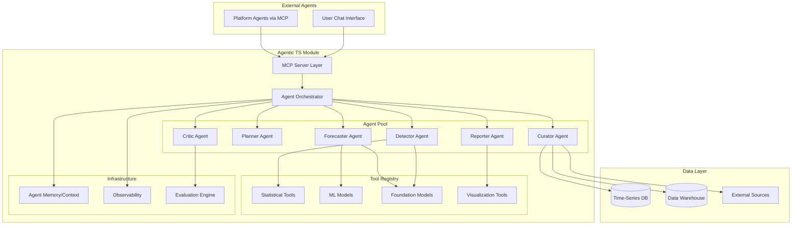

# Technical Design Document (TDD)
## Agentic AI × Time-Series Analytics Platform Module

> **Standard**: IEEE 29148-2018 (companion to SRS)  
> **Version**: 1.0  
> **Date**: 2026-05-27  
> **Profile**: research_and_docs_only

---

## 1. System Architecture

### 1.1 High-Level Architecture



### 1.2 Component Responsibilities

| Component | Responsibility | Technology Options |
|-----------|---------------|-------------------|
| MCP Server | Expose tools to external agents | Python + MCP SDK |
| Orchestrator | Route tasks, manage agent lifecycle, enforce gates | Python (asyncio) |
| Curator Agent | Data acquisition, preprocessing, validation | pandas + connectors |
| Planner Agent | Strategy selection (which model/tool for this task) | LLM-driven |
| Forecaster Agent | Execute predictions using TSFMs/ML models | TimesFM / Chronos / Time-MoE |
| Detector Agent | Anomaly detection (statistical + learned) | Statistical tests + TSFM |
| Reporter Agent | Generate NL explanations + visualizations | LLM + matplotlib/plotly |
| Critic Agent | Validate outputs, suggest improvements | LLM + evaluation metrics |
| Tool Registry | Unified interface for all analytical tools | Plugin architecture |
| Memory/Context | Persist agent state across turns | Vector store + JSON logs |
| Observability | Latency, token usage, confidence tracking | OpenTelemetry + custom metrics |
| Evaluation Engine | Benchmark against TimeSeriesGym/GIFT-Eval | pytest + custom harness |

---

## 2. Technology Stack Options (≤ 3, mutually exclusive)

| Option | Language/Runtime | TSFM | Agent Framework | Tradeoff |
|--------|-----------------|------|-----------------|----------|
| **A: Python + TimesFM + OpenAI Agents SDK** | Python 3.11+ | TimesFM 2.5 (JAX) | OpenAI Agents SDK | Best ecosystem; JAX dependency adds complexity |
| **B: Python + Time-MoE + Qwen-Agent** | Python 3.11+ | Time-MoE (PyTorch) | Qwen-Agent (MCP-native) | Lowest VRAM (8GB); Chinese-community-first docs |
| **C: Python + Chronos-2 + Custom MCP Orchestrator** | Python 3.11+ | Chronos-2 (PyTorch/HF) | Custom (lightweight) | Most flexible; highest dev effort |

**Recommendation**: Option A for production maturity + community; Option B for cost efficiency.

---

## 3. Data Flow

### 3.1 Forecasting Pipeline

```
User/Agent Request (NL or structured)
    │
    ▼
┌─────────────┐
│ MCP Server  │ ← Parse input, validate schema
└─────┬───────┘
      │
      ▼
┌─────────────┐
│ Orchestrator│ ← Select pipeline: simple (1-agent) vs complex (multi-agent)
└─────┬───────┘
      │
      ├── Simple: Forecaster Agent directly
      │
      └── Complex:
            │
            ▼
      ┌──────────┐
      │ Curator  │ ← Fetch data, preprocess, validate quality
      └────┬─────┘
           │
           ▼
      ┌──────────┐
      │ Planner  │ ← Analyze data characteristics, select model/strategy
      └────┬─────┘
           │
           ▼
      ┌────────────┐
      │ Forecaster │ ← Execute prediction(s), generate intervals
      └────┬───────┘
           │
           ▼
      ┌──────────┐
      │ Critic   │ ← Validate output quality, check for issues
      └────┬─────┘
           │
           ▼
      ┌──────────┐
      │ Reporter │ ← Generate NL explanation + visualization
      └────┬─────┘
           │
           ▼
      Response (forecast + explanation + confidence + metadata)
```

### 3.2 Tool Invocation Protocol

```python
class ToolInvocation(BaseModel):
    tool_name: str            # e.g. "timesfm_forecast"
    parameters: dict          # tool-specific params
    context: ToolContext       # series data, metadata

class ToolResult(BaseModel):
    status: Literal["success", "error", "partial"]
    output: Any               # tool-specific output
    confidence: float | None  # 0.0-1.0
    latency_ms: int
    token_usage: int | None
```

---

## 4. Interface Definitions

### 4.1 MCP Tool: `forecast`

```json
{
  "name": "forecast",
  "description": "Generate time-series forecasts with prediction intervals",
  "inputSchema": {
    "type": "object",
    "properties": {
      "series": {"type": "array", "items": {"type": "number"}, "description": "Historical values"},
      "horizon": {"type": "integer", "minimum": 1, "description": "Steps to forecast"},
      "frequency": {"type": "string", "enum": ["1min", "5min", "1h", "1d", "1w", "1M"]},
      "quantiles": {"type": "array", "items": {"type": "number"}, "default": [0.1, 0.5, 0.9]},
      "context": {"type": "string", "description": "Optional NL context about the domain"}
    },
    "required": ["series", "horizon"]
  }
}
```

### 4.2 MCP Tool: `detect_anomalies`

```json
{
  "name": "detect_anomalies",
  "description": "Detect anomalies in time-series data",
  "inputSchema": {
    "type": "object",
    "properties": {
      "series": {"type": "array", "items": {"type": "number"}},
      "anomaly_types": {"type": "array", "items": {"type": "string", "enum": ["point", "structural", "seasonal", "pattern"]}},
      "sensitivity": {"type": "number", "minimum": 0, "maximum": 1, "default": 0.5}
    },
    "required": ["series"]
  }
}
```

### 4.3 MCP Tool: `analyze_series`

```json
{
  "name": "analyze_series",
  "description": "Perform general analysis: trend, seasonality, stationarity, statistics",
  "inputSchema": {
    "type": "object",
    "properties": {
      "series": {"type": "array", "items": {"type": "number"}},
      "question": {"type": "string", "description": "Natural language question about the series"},
      "analyses": {"type": "array", "items": {"type": "string", "enum": ["trend", "seasonality", "stationarity", "statistics", "decomposition"]}}
    },
    "required": ["series"]
  }
}
```

---

## 5. Agent Communication Protocol

### 5.1 Inter-Agent Messages

```python
class AgentMessage(BaseModel):
    sender: str           # agent role name
    receiver: str         # agent role name or "orchestrator"
    msg_type: Literal["request", "response", "feedback", "handoff"]
    content: dict         # payload
    metadata: MessageMeta # timestamp, token_count, confidence

class MessageMeta(BaseModel):
    timestamp: datetime
    turn_id: int
    token_count: int
    confidence: float | None
    reasoning_chain: list[str] | None
```

### 5.2 Orchestrator Routing Rules

| Task Complexity | Routing | Agents Involved |
|----------------|---------|-----------------|
| Simple forecast (< 1K points, single series) | Direct | Forecaster only |
| Complex forecast (> 1K points or multivariate) | Pipeline | Curator → Planner → Forecaster → Reporter |
| Anomaly detection | Pipeline | Curator → Detector → Reporter |
| Full analysis | Multi-agent | Curator → Planner → Forecaster + Detector → Critic → Reporter |

---

## 6. Deployment Architecture

```
┌─────────────────────────────────────────────┐
│           Platform Kubernetes Cluster         │
│                                               │
│  ┌──────────────┐     ┌──────────────────┐  │
│  │ MCP Server   │     │ Agent Orchestrator│  │
│  │ (Stateless)  │────▶│ (Stateful/Session)│  │
│  │ Replicas: 3  │     │ Replicas: 2       │  │
│  └──────────────┘     └────────┬─────────┘  │
│                                 │             │
│  ┌──────────────────────────────▼──────────┐ │
│  │         TSFM Inference Service           │ │
│  │  TimesFM 2.5 / Time-MoE / Chronos-2    │ │
│  │  GPU: A10G (24GB) × 1-2                 │ │
│  └─────────────────────────────────────────┘ │
│                                               │
│  ┌─────────────┐  ┌─────────────────────┐   │
│  │ Redis       │  │ Object Store (S3)    │   │
│  │ (Session)   │  │ (Artifacts/Logs)     │   │
│  └─────────────┘  └─────────────────────┘   │
└─────────────────────────────────────────────┘
```

---

## 7. Observability & Safety

### 7.1 Metrics

| Metric | Source | Alert Threshold |
|--------|--------|-----------------|
| Forecast latency (p95) | TSFM service | > 30s for < 1K pts |
| Agent turn count | Orchestrator | > 20 turns per request |
| Token usage per request | All agents | > 100K tokens |
| Forecast confidence | Critic agent | < 0.3 |
| Anomaly false positive rate | Evaluation engine | > 20% |

### 7.2 Safety Guardrails

| Guardrail | Implementation | Reference |
|-----------|----------------|-----------|
| Autonomous rule deployment review | Human approval before production deployment | Argos (Microsoft) |
| Forecast confidence thresholds | Refuse to output if confidence < 0.2 | Platform policy |
| Token budget enforcement | Hard kill at 1M tokens per session | v2 §7.1 |
| Data boundary enforcement | No external data access without explicit permission | Platform security |
