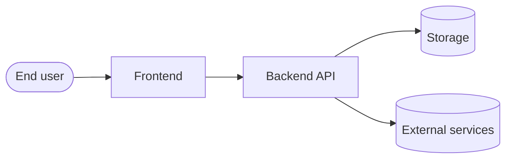

# Architecture diagram template

This Markdown file is a starting point for the architecture diagram embedded
in the TDD. Edit the Mermaid block to match the chosen design.

**Companion prose** (IEEE 29148 §5.4.4 requires every diagram to be paired
with explanatory text):

- *End user* drives the prototype through the frontend.
- *Frontend* is a {{ chosen_stack.language }} client speaking HTTPS to the backend.
- *Backend API* implements the requirements enumerated in `srs.md`.
- *Storage* persists state; the choice between SQLite / Postgres / file is
  recorded in the TDD §4.
- *External services* are documented in the SRS §3.2 (external interfaces).
